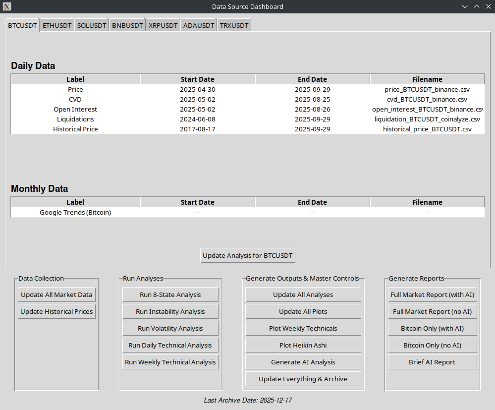

# CryptoAlertBot

CryptoAlertBot is a Python-based research tool for analyzing cryptocurrency markets, generating charts, and producing markdown/PDF reports with optional AI commentary.

There is an example report with AI commentary in the `examples/` directory. The commentary is slightly naive, but it illustrates a proof of concept for AI integration.

**Note**: This app was started in May 2025 and was in development until mid August 2025. It doesn't utilize the latest AI models at the time of writing (December 2025).



## Features

- **Multi-asset support**
  - Default focus on major futures pairs such as BTCUSDT, ETHUSDT, SOLUSDT, BNBUSDT, XRPUSDT, ADAUSDT, TRXUSDT (configurable via `data/config.json`).

- **Data collection**
  - Daily price, CVD, open interest, liquidations, historical and intraday prices using custom collectors.
  - Metadata tracking so you can see date ranges and filenames directly in the GUI.

- **Market analysis**
  - 8-state regime model combining price, open interest, and CVD.
  - Instability analysis from liquidation data.
  - Volatility analysis with Sharpe/Sortino/Omega, drawdowns, RSI, volatility state, etc.
  - Run-length / momentum analysis for simple streak-based predictions.

- **Technical analysis & signals**
  - RSI, MACD, moving averages, Bollinger Bands.
  - UT Bot alerts (standard + Heikin-Ashi) with ATR and trailing stops.
  - Bollinger Bands on MACD to highlight overextended momentum.
  - Daily and weekly timeframes.

- **Plotting**
  - Price, CVD, OI, liquidations, combined plot.
  - Technical plots, UT Bot plots, BB-on-MACD plots, Heikin-Ashi plots.
  - Outputs go to `plots/` (PNG/SVG).

- **Reporting**
  - Full multi-asset market report (`market_report_YYYYMMDD.{md,pdf}`).
  - Bitcoin-only report (`bitcoin_report_YYYYMMDD.{md,pdf}`).
  - AI-driven brief market / Bitcoin commentary and technical interpretations.
  - Nicely formatted PDFs using `wkhtmltopdf` and a custom CSS stylesheet.

- **GUI dashboard**
  - Tkinter app (`main.py`) for running data updates, analyses, plots, and reports with buttons.
  - Per-asset tabs showing what data you have and date coverage.

## Project structure

High-level layout:

- **`main.py`** – Tkinter GUI entry point; orchestrates collectors, analyzers, plotters, reporters.
- **`src/collectors/`** – Download / update price, CVD, OI, liquidations, historical & intraday prices.
- **`src/analyzers/`**
  - `eight_state_analyzer.py` – price/OI/CVD state model.
  - `instability_analyzer.py` – liquidation-based instability index.
  - `price_volatility_analyzer.py` – volatility + risk metrics (Sharpe, Sortino, CVaR, Omega, drawdown, etc.).
  - `technical_analyzer.py` – RSI, MACD, SMAs, Bollinger Bands, UT Bot signals, etc.
  - `run_analyzer.py`, `run_predictor.py` – run-length / momentum analysis and predictions.
- **`src/plotters/`** – Matplotlib/mplfinance plots: price, CVD, OI, liquidations, combined, technical, UT Bot, BB-on-MACD, Heikin-Ashi.
- **`src/reporters/`**
  - `markdown_reporter.py` – full multi-asset report (markdown + PDF).
  - `markdown_reporter_alt.py` – alternative brief AI report.
  - `ai_market_reporter.py` / `_alt.py` – AI prompt logic and helpers.
  - `technical_interpreter.py` – turns recent indicators into human-readable text.
- **`src/ai_helper.py`** – common wrapper for OpenAI, Gemini and (optionally) Claude models.
- **`data/`** – Input and derived data (daily/weekly prices, analysis CSVs, predictions, config).
- **`reports/`** – Generated markdown/PDF reports.
- **`plots/`** – Generated chart images.
- **`archive/`** – Archived data and analysis.
- **`requirements.txt`** – Python dependencies.

## Requirements

- Python 3.10+ (recommended)
- System packages:
  - **wkhtmltopdf** (required for PDF generation via `pdfkit`)
- Python packages (installed via `requirements.txt`):
  - `pandas`, `requests`, `pdfkit`, `markdown`, `matplotlib`, `mplfinance`, `lxml`,
    `openai`, `python-dotenv`, `google-generativeai`, `anthropic`

## Installation

```bash
git clone https://github.com/EdwardAThomson/CryptoAlertBot.git
cd CryptoAlertBot

# (optional but recommended)
python -m venv .venv
source .venv/bin/activate  # Windows: .venv\Scripts\activate

pip install -r requirements.txt
```

Install `wkhtmltopdf` from your package manager or https://wkhtmltopdf.org.
If it is missing, markdown reports will still be generated but PDF export will fail with a logged warning.

## Configuration

### 1. Set up API keys (for AI features)

Create a `.env` file in the project root (or otherwise set environment variables):

```env
OPENAI_API_KEY=sk-...
GEMINI_API_KEY=...
# Optional: other provider keys if you enable those models
# ANTHROPIC_API_KEY=...
```

The `src/ai_helper.py` module uses these to talk to OpenAI / Gemini, and AI-based reporters rely on it.

If you do **not** want to use AI at all, you can:

- Leave the keys unset and avoid AI-specific buttons / scripts, or
- Set `DISABLE_AI_REPORTING=true` in your environment when generating reports.

### 2. Configure tracked assets

Assets are defined in `data/config.json`:

```json
{
  "assets": ["BTCUSDT", "ETHUSDT", "SOLUSDT", "BNBUSDT", "XRPUSDT", "ADAUSDT", "TRXUSDT"]
}
```

You can edit this list to add/remove symbols. Make sure your collectors support the symbols you add.

## Usage

### Run the GUI

From the project root:

```bash
python main.py
```

The main window shows:

- Tabs for each asset in `data/config.json`.
- Tables listing available data sources (Price, CVD, OI, Liquidations, Historical Price) and their date coverage.
- Control panels with buttons to update data, run analyses, generate plots, and build reports.

### Typical workflow

1. **Update market data**

   In the GUI, under **Data Collection**:
   - Click **"Update All Market Data"** to fetch CVD, OI, price, liquidations, historical + intraday data, then refresh metadata.

   Or click **"Update Historical Prices"** if you only need the higher-level OHLC history.

2. **Run analyses**

   Under **Run Analyses**:
   - **Run 8-State Analysis** – price/OI/CVD regime signals.
   - **Run Instability Analysis** – liquidation-based instability index.
   - **Run Volatility Analysis** – Sharpe/Sortino/volatility metrics.
   - **Run Daily Technical Analysis** – daily indicators and UT Bot signals.
   - **Run Weekly Technical Analysis** – weekly timeframe technicals.

   Or click **Update Analysis** in **Generate Outputs & Master Controls** to run the full pipeline for all assets (including run-distribution updates and predictions).

3. **Generate plots**

   Under **Generate Outputs & Master Controls**:
   - **Update All Plots** – generates:
     - Price, CVD, OI, liquidations, combined charts
     - Technical plots (daily + weekly)
     - UT Bot plots (daily + weekly)
     - BB-on-MACD plots (daily + weekly)
     - Heikin-Ashi plots (daily + weekly)

   - **Plot Weekly Technicals** – weekly-only technical, UT Bot, and BB-on-MACD plots.
   - **Plot Heikin Ashi** – Heikin-Ashi only.

   Plots are saved into the `plots/` directory.

4. **Generate reports**

   Under **Generate Reports**:

   - **Full Market Report (with AI)**  
     - Calls `src/reporters/markdown_reporter.generate_report()` with AI enabled.  
     - Outputs `reports/market_report_YYYYMMDD.md` and `.pdf`.

   - **Full Market Report (no AI)**  
     - Runs the same report with `DISABLE_AI_REPORTING=true`, omitting AI sections.

   - **Bitcoin Only (with AI / no AI)**  
     - Uses `generate_bitcoin_only_report()` to build a BTC-focused version.  
     - Outputs `reports/bitcoin_report_YYYYMMDD.md` and `.pdf`.

   - **Brief AI Report**  
     - Uses the alternative brief reporter (`markdown_reporter_alt`) for a shorter AI-focused summary.

5. **Standalone AI analysis (optional)**

   - **Generate AI Analysis** button calls `src/reporters.ai_market_reporter.generate_ai_bitcoin_analysis` and saves detailed AI analysis JSON under `data/analysis/`.

## AI controls

- The env var `DISABLE_AI_REPORTING` is checked dynamically inside `markdown_reporter.py`.
  - `'true'` (case-insensitive) → no AI content is added to reports.
  - Any other value (or unset) → AI sections are allowed, assuming API keys are configured.

- GUI "no AI" buttons temporarily set this variable for the duration of the report generation.

If AI calls fail (e.g., missing keys), the code logs an error and falls back to placeholder text where possible.

## Data & outputs

- **Input / raw & intermediate**
  - `data/daily/` – daily data (price, CVD, OI, liquidations, etc.).
  - `data/weekly/` – weekly aggregates (if applicable).
  - `data/analysis/` – CSV outputs from analyzers (signals, volatility, technical, instability, etc.).
  - `data/predictions/` – JSON files with run/streak-based predictions.
  - `data/config.json` – list of tracked assets and configuration.

- **Generated artifacts**
  - `plots/` – all static chart images.
  - `reports/` – markdown + PDF reports.
  - `archive/` – historical archive created via the **Update Everything & Archive** button.

## Disclaimer

CryptoAlertBot is a research and experimentation tool.

It is **not** financial advice and should not be used as the sole basis for any trading or investment decisions.
Use it at your own risk.
